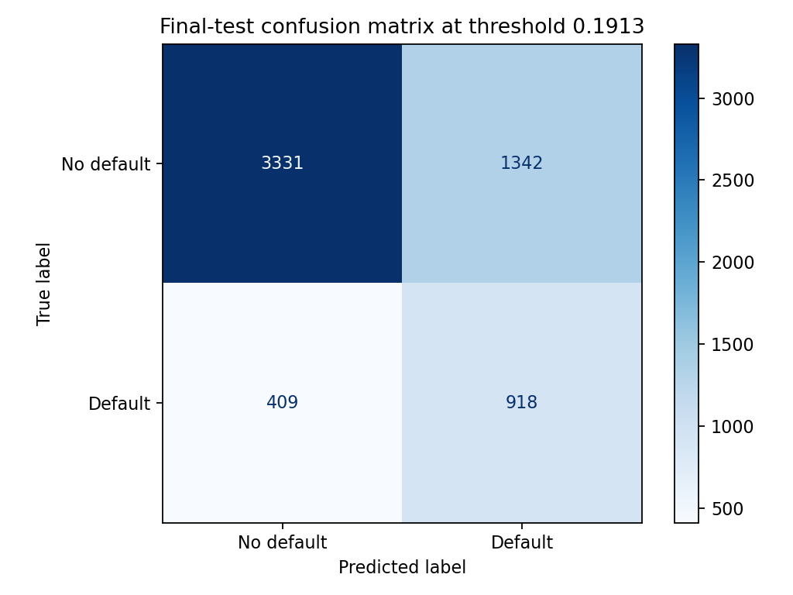
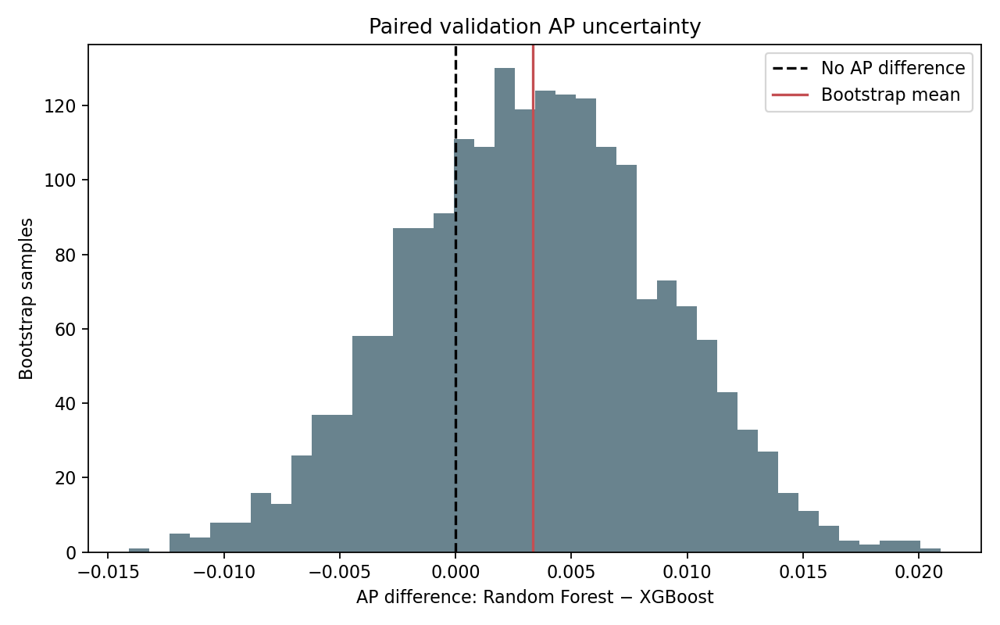
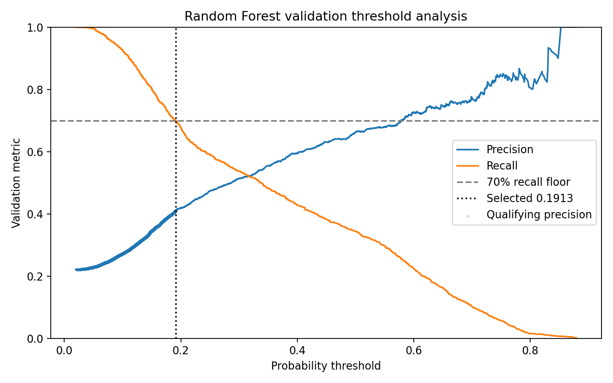
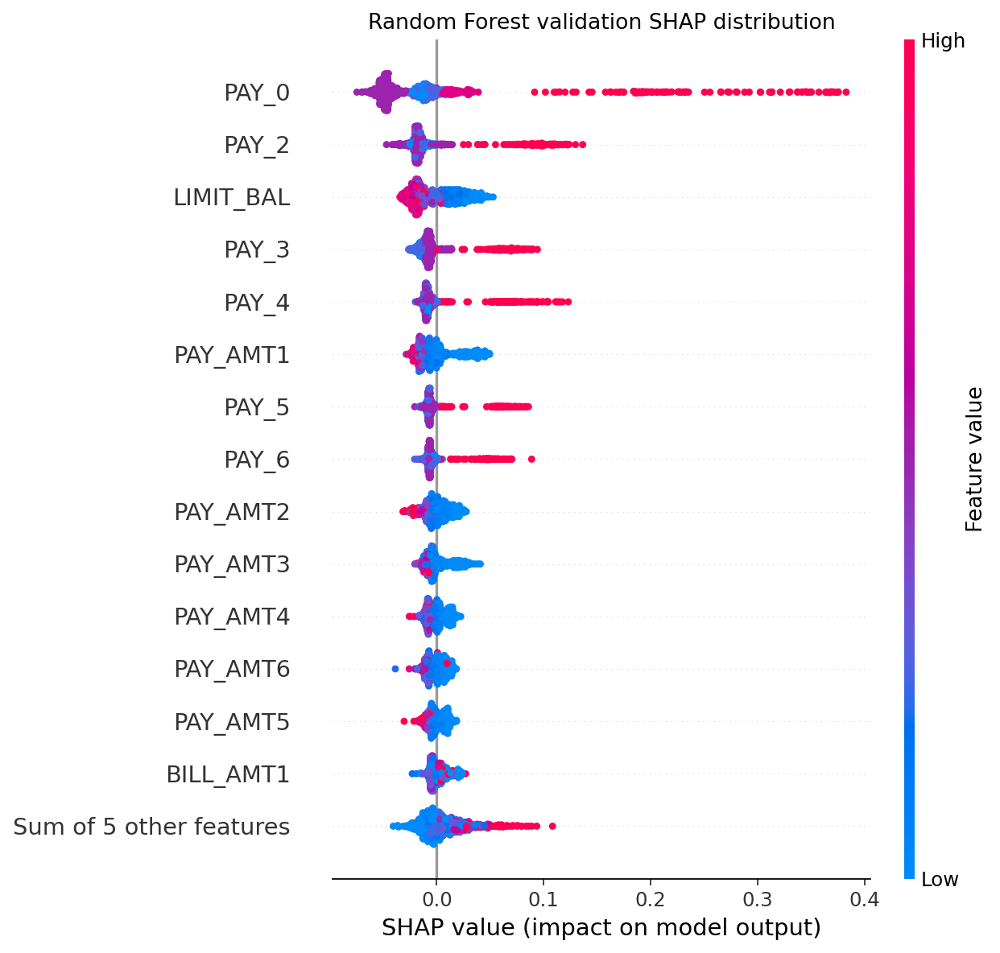

# CreditLens

**Leakage-aware credit-default prediction with frozen validation decisions, explainable risk signals and a one-time held-out evaluation.**

CreditLens asks a practical modelling question: how well can information available at the end of a billing period rank next-month default risk without leaking future outcomes into development? It compares Logistic Regression, Random Forest and XGBoost on the UCI **Default of Credit Card Clients** dataset, while keeping preprocessing, duplicate-profile groups, model selection and threshold selection inside explicit data boundaries.

This is a methodological portfolio project, not a deployable lending system or automated credit decision tool.

## Final held-out results

Before final-test access, the project locked the selected Random Forest pipeline, its embedded preprocessing, SHA-256 hash and validation-selected threshold. The frozen pipeline was then evaluated once on 6,000 held-out rows.

| Final-test measure | Result |
|---|---:|
| Class prevalence | 0.221167 |
| ROC-AUC | 0.779397 |
| Average Precision (AP) | 0.557033 |
| Precision at frozen threshold | 0.406195 |
| Recall at frozen threshold | 0.691786 |
| F1 | 0.511848 |
| False-positive rate | 0.287182 |
| Proportion flagged | 0.376667 |

Final-test confusion matrix:

```text
[[3331, 1342],
 [ 409,  918]]
```

The frozen threshold was `0.1912638431828811`. Final-test recall fell below 70%, but the 70% requirement was a **validation selection target**, not a guaranteed test result. No decision was changed after the final-test results were viewed.

> **Final-test consumption notice:** the project author has completed the authorised one-time final evaluation. `python -m src.final_evaluation` must not be rerun by the project author, and the model, preprocessing and threshold must not be revised from these results. The saved aggregate artefacts are the canonical final evaluation record.

See the [decision lock](reports/day7_final_decision_lock.json), [aggregate metrics](reports/day7_final_test_metrics.json) and [final report](reports/DAY7_FINAL_EVALUATION_REPORT.md).



## Why leakage control matters

Credit-risk metrics can look stronger than they really are when future information, duplicate profiles or validation decisions leak into training. CreditLens uses the following controls:

- Prediction timing is fixed at the end of September 2005; the outcome is default in October 2005.
- `ID`, the target, four audit-only demographic fields and every derived `*_CATEGORY` field are excluded from the primary model.
- All rows sharing the same 23-predictor profile remain in one train, validation or test partition.
- Preprocessing is fitted inside each model pipeline, using training data only.
- Random Forest and XGBoost searches use four-fold `StratifiedGroupKFold` within training only, with zero group overlap.
- Validation is used for model comparison, paired uncertainty and threshold selection.
- A machine-readable decision lock is written before final-test outcomes are loaded.
- Only the frozen Random Forest is scored on final test; no alternative model is compared there.
- No general row-level validation or final-test prediction file is published.

The persisted allocation is 18,000 training, 6,000 validation and 6,000 final-test rows. Full controls and risks are recorded in the [leakage register](docs/LEAKAGE_REGISTER.md).

## Model selection and uncertainty

Random Forest had the highest numerical validation AP:

| Model | Validation ROC-AUC | Validation AP |
|---|---:|---:|
| Logistic Regression | 0.754405 | 0.519471 |
| Random Forest | 0.771917 | 0.539980 |
| XGBoost | 0.771792 | 0.536643 |

The Random-Forest-minus-XGBoost AP difference was only `0.003336`. A fixed-seed, 2,000-iteration paired stratified bootstrap produced a 95% interval of `[-0.007522, 0.013794]`. Because that interval spans zero and the numerical difference is negligible, the project makes **no superiority claim**.

Random Forest is therefore the frozen evaluation candidate on the stated validation rule, not proof that it is universally better than XGBoost.



## Threshold trade-off

The operating threshold was selected on validation only using a predeclared rule:

1. require default-class recall of at least 70%;
2. among qualifying thresholds, maximise precision;
3. if precision ties exactly, choose the highest threshold.

At the selected validation threshold:

| Validation measure | Result |
|---|---:|
| Precision | 0.410880 |
| Recall | 0.700075 |
| F1 | 0.517837 |
| False-positive rate | 0.285042 |
| Proportion flagged | 0.376833 |

The 70% recall target is an illustrative portfolio assumption, not a regulatory or lending standard. Raising recall flags more customers for review and increases false-positive review cost; raising precision generally misses more defaults.



## Explainability and error analysis

Tree SHAP explains the frozen Random Forest using a deterministic, class-stratified sample of 1,000 validation rows. Repayment status (`PAY_0`, `PAY_2`), credit limit and later repayment-status fields are the leading global model signals.



The project also contains exactly three clearly labelled validation case studies:

- one true positive;
- one false positive;
- one false negative.

Aggregate error analysis found 1,332 validation false positives and 398 false negatives at the frozen threshold. These explanations describe model associations, not causes. Correlated billing and payment fields can divide or mask SHAP contributions, and an individual waterfall is not a lending reason or representative customer narrative.

## Project progression

| Day | Completed work |
|---|---|
| 1 | Verified the official UCI source and CC BY 4.0 terms; fixed provenance, target timing, data dictionary, prediction-time fields, leakage register and split design. |
| 2 | Validated raw checksums and data quality; created deterministic group-aware split assignments and reproducible EDA. |
| 3 | Built the leakage-safe Logistic Regression baseline. |
| 4 | Ran bounded, training-only grouped-CV Random Forest selection and validation interpretation. |
| 5 | Ran bounded, training-only grouped-CV XGBoost selection and validation comparison. |
| 6 | Quantified paired validation uncertainty, froze the recall-constrained threshold, produced Tree SHAP explanations and analysed errors. |
| 7 | Wrote the decision lock and completed the one-time aggregate final-test evaluation without post-test changes. |

## Reproducibility boundaries

The training and validation workflows remain reproducible:

```sh
python -m pip install -r requirements.txt
Rscript scripts/day2_prepare.R
python -m src.train
python -m src.random_forest
python -m src.xgboost_model
python -m src.day6_analysis
python -m unittest discover -s tests -v
```

The raw UCI files are intentionally not proposed for the public Git commit. Follow [data/README.md](data/README.md) to download the official archive, verify its checksum and regenerate the validated table. The persisted `data/processed/split_assignments.csv` is retained so all models use the approved row assignments.

The commands above are for reproducibility and independent review, but recreating a model does not authorise the project author to re-open the consumed final test. The completed project author must **not** run `python -m src.final_evaluation` again.

`src/final_evaluation.py` remains in the repository to make the completed procedure auditable. Its command exists only for an independent clean reproduction that has first reconstructed the project from scratch, verified `reports/day7_final_decision_lock.json`, and accepted that its own held-out evaluation will consume its clean test partition. It is not part of the project author's repeatable workflow.

Saved `.joblib` files are Python binary artefacts. Load them only from this trusted repository and verify the frozen Random Forest hash against the decision lock before inspection.

## Repository structure

```text
.
├── data/
│   ├── README.md                     # acquisition, attribution and checksums
│   └── processed/split_assignments.csv
├── docs/                             # Day 1 specification, dictionary, leakage register
├── models/                           # approved fitted pipelines
├── notebooks/                        # executed analysis and presentation notebooks
├── reports/
│   ├── figures/                      # portfolio-ready aggregate figures
│   ├── DAY*_*.md                     # stage reports
│   └── day*_*.json/csv               # aggregate audit artefacts
├── scripts/day2_prepare.R            # deterministic data preparation
├── src/                              # reusable modelling and evaluation code
├── tests/                            # Day 2–Day 7 safeguards
├── PROJECT_PLAN.md
└── requirements.txt
```

## Data and licensing

The dataset is **Default of Credit Card Clients**, created by I-Cheng Yeh and distributed by the UCI Machine Learning Repository:

- UCI catalogue: <https://archive.ics.uci.edu/dataset/350/default+of+credit+card+clients>
- DOI: <https://doi.org/10.24432/C55S3H>
- Dataset licence: [Creative Commons Attribution 4.0 International](https://creativecommons.org/licenses/by/4.0/)

Original CreditLens code and original project documentation are licensed under the [MIT Licence](LICENSE), copyright © 2026 Grace Du. The UCI dataset and dataset-derived materials are not relicensed by MIT; they remain subject to CC BY 4.0 with their own attribution and terms. See [THIRD_PARTY_NOTICES.md](THIRD_PARTY_NOTICES.md) for the precise boundary.

## Limitations

- The data describe Taiwanese credit-card clients and 2005 behaviour; results should not be generalised to current UK lending.
- This is a single historical public dataset, not a temporal or external validation study.
- Validation-based model selection and thresholding retain sampling uncertainty.
- Excluding demographic fields from the model does not guarantee fairness or regulatory compliance; correlated predictors may act as proxies.
- SHAP and feature importance are associative, sensitive to correlated features and non-causal.
- No calibration study, stability monitoring, population-drift analysis, fairness certification or lending-policy validation is included.
- The model is not approved for deployment, automated decisions, customer-level explanations or causal claims.
